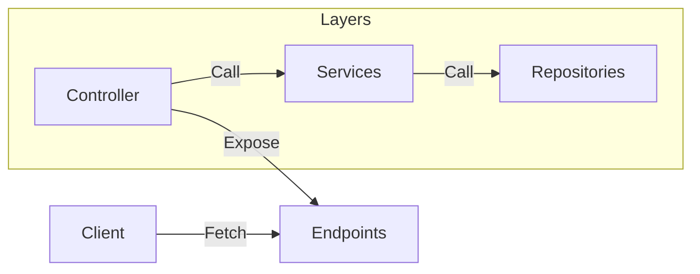
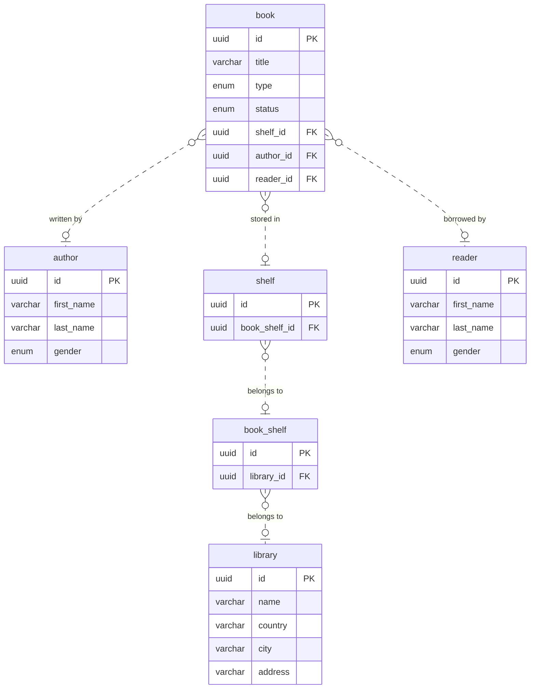

# Library API

Library API is a REST API for managing books, authors, readers, and the physical organization of a library. Built with Java, Spring Boot, and PostgreSQL, it provides CRUD endpoints for libraries, bookcases, shelves, and books, including each book's category, availability status, author, and associated reader.

## Contents

- [Getting started](#getting-started)
- [Project structure](#project-structure)
- [Configuration](#configuration)
- [How it works](#how-it-works)
- [Using the API](#using-the-api)
- [Useful commands](#useful-commands)
- [Database and sample data](#database-and-sample-data)

## Project structure

```text
src/main/java/com/slain/library/
├── controller/     HTTP endpoints
├── service/        Resource operations
├── repository/     Spring Data JPA repositories
├── model/          Database entities & relationships
├── enums/          Custom entities properties values
├── exceptions/     Custom HTTP exceptions
├── seeder/         Sample data
└── LibraryApiApplication.java
Dockerfile
docker-compose.yml
Makefile
.env.example
```

## Getting started

### Prerequisites

- Docker with Docker Compose
- JDK 25
- Make

### Quick start

#### Local application with Docker PostgreSQL

**1. Create your configuration file.**

```sh
cp .env.example .env
```

The example configuration connects the local application to PostgreSQL at `localhost:5432`.

**2. Start the database.**

```sh
make db
```

Wait for PostgreSQL to finish starting before running the application.

**3. Start the application.**

```sh
make run
```

The API is available at **http://localhost:8080**. Hibernate updates the database schema from the JPA models on startup.

#### Run everything with Docker

**1. Create your configuration file.**

If `.env` does not already exist:

```sh
cp .env.example .env
```

**2. Build and start the application and database.**

```sh
make build
make up
```

Docker builds the application with JDK 25 and runs it with a Java 25 runtime. The API is available at **http://localhost:8080**, or the host port configured by `APP_PORT`.

**3. Stop the containers when finished.**

Database data is preserved:

```sh
make down
```
Docker Compose automatically uses `database:5432` for the application container. Keep `DATASOURCE_URL` configured with `localhost:${POSTGRES_PORT}` for local Java, Maven and Make commands. Local and containerized applications cannot both bind to the same host port.

## Configuration

The local application imports `.env` through `application.properties`. Docker Compose reads the same file and passes the datasource settings to the application container.

| Variable            | Example value                              | Purpose                                                |
|---------------------|--------------------------------------------|--------------------------------------------------------|
| `APP_PORT`          | `8080`                                     | Host port exposed by the Docker application container  |
| `POSTGRES_DB`       | `library`                                  | PostgreSQL database name                               |
| `POSTGRES_USER`     | `library`                                  | PostgreSQL username                                    |
| `POSTGRES_PASSWORD` | `library`                                  | PostgreSQL password                                    |
| `POSTGRES_PORT`     | `5432`                                     | Database port exposed on the host's loopback interface |
| `DATASOURCE_URL`    | `jdbc:postgresql://localhost:5432/library` | JDBC connection URL for local Java, Maven and Make commands |

For local execution, the application listens on port `8080` by default.

> [!WARNING]
> If you change `POSTGRES_PORT` or `POSTGRES_DB`, update the local JDBC URL to match. Containers always use the internal database port `5432`.

## How it works

Requests pass through three layers: 
- **controllers** expose HTTP endpoints
- **services** implement resource operations
- **repositories** persist JPA entities in PostgreSQL



The main relationships are:

- A library contains `BookShelf`, which contains `Shelf`.
- Each `Book` belongs to a `Shelf` and has an `Author`.
- A `Book` can also reference a `Reader`.



### Enums

#### BookType

Defines the category of a book through its `type` field.

| Value      | Description                                             |
|------------|---------------------------------------------------------|
| `HORROR`   | Stories intended to evoke fear.                         |
| `THRILLER` | Stories focused on suspense and tension.                |
| `FANTASY`  | Stories featuring imaginary worlds or magical elements. |
| `ROMANCE`  | Stories centered on romantic relationships.             |

#### BookStatus

Defines the current status of a book through its `status` field.

| Value       | Description                      |
|-------------|----------------------------------|
| `AVAILABLE` | The book is available to borrow. |
| `RENTED`    | The book is currently borrowed.  |
| `LOST`      | The book is recorded as lost.    |
| `RESERVED`  | The book is reserved.            |

#### GenderType

Defines the gender of an author or reader through their `gender` field.

| Value    | Description                         |
|----------|-------------------------------------|
| `MALE`   | Male gender.                        |
| `FEMALE` | Female gender.                      |
| `OTHER`  | A gender other than male or female. |

## Using the API

Base URL for the default setup: `http://localhost:8080`.

| Resource  | Path         |
|-----------|--------------|
| Books     | `/book`      |
| Authors   | `/author`    |
| Libraries | `/library`   |
| Bookcases | `/bookshelf` |
| Shelves   | `/shelf`     |

Controllers expose the following operations, subject to the access rules below:

| Method   | Route              | Operation                        |
|----------|--------------------|----------------------------------|
| `GET`    | `/{resource}`      | List all records                 |
| `GET`    | `/{resource}/{id}` | Retrieve a record by UUID        |
| `POST`   | `/{resource}`      | Create a record from a JSON body |
| `PUT`    | `/{resource}/{id}` | Update a record from a JSON body |
| `DELETE` | `/{resource}/{id}` | Delete a record                  |

### Authentication and access

Authentication uses an email, a BCrypt password hash and a server session (`JSESSIONID`).

1. Register with `POST /auth/register` and a JSON body such as:

   ```json
   {
      "email":"reader@example.com",
      "password":"a-long-secret-password",
      "firstName":"Alice",
      "lastName":"Martin",
      "gender":"FEMALE"
   }
   ```

   Passwords require at least 8 characters. Registration returns `201` and does not log you in.
2. Log in with `POST /auth/login` and a JSON body:

   ```json
   {
      "email":"reader@example.com",
      "password":"a-long-secret-password"
   }
   ```

   Success returns `204`; invalid credentials return `401`. Retain the `JSESSIONID` cookie returned by the server.
3. Call `GET /me` with that session cookie to retrieve the signed-in profile. This is the only route that requires authentication.
4. Call `POST /auth/logout` to invalidate the session. It returns `204`.

Emails are matched exactly, including case. The `/reader` and `/reader/{id}` routes are disabled; create accounts through `/auth/register` and retrieve the current account through `/me`.

Books, authors, libraries, bookcases and shelves are public resources: their GET, POST, PUT and DELETE routes can be used without authentication. Password hashes and book-to-reader links are never included in JSON. Existing JPA removal cascades still apply: deleting an author or shelf (including through a parent library or bookcase) can delete associated books.

Unauthenticated requests to `/me` return `401`. Disabled reader routes return `404`.

The development seeders create two login-ready sample readers. Their passwords are stored as BCrypt hashes:

| Email                         | Password      |
|-------------------------------|---------------|
| `reader@example.com`          | `password123` |
| `thomas.bernard@example.com`  | `password123` |

These credentials are intended for local development only. Register a dedicated reader for any non-development environment.

## Useful commands

| Command           | Description                                       |
|-------------------|---------------------------------------------------|
| `make help`       | Show available shortcuts                          |
| `make db`         | Start only PostgreSQL in the background           |
| `make run`        | Run the application locally                       |
| `make build`      | Build Docker images                               |
| `make up`         | Start Docker Compose services in the background   |
| `make shell`      | Open a shell in the running application container |
| `make down`       | Stop containers and preserve database volumes     |

## Database and sample data

These Make commands run Java on your host and require JDK 25 and a `DATASOURCE_URL` pointing to `localhost` with the configured `POSTGRES_PORT`. They start PostgreSQL and wait for it to be healthy before running.

Update the schema without starting the HTTP server:

```sh
make db:update
```

Load the complete sample dataset:

```sh
make db:seed
```

Or select a seeder:

```sh
make db:seed <seeder-name>
```

Seeding uses the `dev` profile. Seeders synchronize their named fixtures and prerequisite data while preserving unrelated records. They can safely be executed again without duplicating the fixture dataset. The fixture keys are the author name, library name, reader email (or the legacy reader name), and book title plus author. Legacy Alice Martin and Thomas Bernard fixtures without credentials are upgraded automatically with the development emails and BCrypt passwords documented above. If a fixture key is duplicated or one of these emails belongs to another reader, seeding stops instead of choosing or overwriting a record arbitrarily.

> [!NOTE]
> **Destructive command:** `make db:drop` deletes all user tables and their data in the configured Docker PostgreSQL database. To recreate an empty schema afterward, run `make db:update`.
